# Personhood Credentials in Open Finance

This project implements **Personhood Credentials (PHC)** in an **Open Finance** scenario, following the requirements defined in the paper ["Personhood credentials: Artificial intelligence and the value of privacy-preserving tools to distinguish who is real online" (arXiv 2408.07892v1)](https://arxiv.org/abs/2408.07892).

Two **AI Agents (Bots)** — each backed by a **Groq-powered chatbot (Llama 3.3 70B)** — cryptographically prove they act on behalf of unique, legitimate humans before accessing sensitive banking data or executing cross-bank payments. The system mitigates Sybil attacks, deepfakes, and automated fraud while preserving privacy through zero-knowledge proofs and unlinkable pseudonyms.

## PHC Compliance

| Requirement | Implementation |
|---|---|
| **Req 1a: One-per-person enrollment** | Biometric liveness detection + HMAC-protected dedup registry + optional ledger-backed dedup |
| **Req 1b: Periodic re-authentication** | `ReauthPolicy` with time-based (24h) and usage-based (100 proofs) triggers + biometric liveness |
| **Req 2a: Storage minimization** | Issuer stores only `person_hash` (one-way SHA-256 commitment), never holder secrets |
| **Req 2b: Usage minimization** | ZKP predicates only — zero attribute disclosure in proofs |
| **Req 2c: Unlinkable pseudonymity** | Holder-local secret (`secrets.token_hex(32)`) — issuer cannot derive pseudonyms even with collusion |

## Architecture

The system uses a **Self-Sovereign Identity (SSI)** architecture with **5 ACA-Py agents**, a **Tails Server**, **Groq-powered chatbots**, a **FastAPI backend**, and a **Gradio UI**:

1. **Issuer (Government):** Validates biometrics, enforces one-per-person, issues the "Personhood" credential.
2. **Holder A (User A's Bot):** AI agent for User A. Stores credentials, derives pseudonyms, presents ZKP proofs. Connected to Bank A.
3. **Holder B (User B's Bot):** AI agent for User B. Independent wallet and secrets. Connected to Bank B.
4. **Verifier A (Bank A):** Requests proof of personhood via ZKP predicates — independent ACA-Py instance.
5. **Verifier B (Bank B):** Second independent bank — cannot link Holder A's or Holder B's activity.
6. **Tails Server:** Manages AnonCreds revocation registries.
7. **Ledger (BCovrin Testnet):** Decentralized infrastructure for DIDs, Schemas, Credential Definitions, and revocation records.

```
                         +-------------+
                         |   Issuer    |
                         | (Government)|
                         |  :8000/01   |
                         +------+------+
                           /    |    \
              issue cred  /     |     \  issue cred
                         /      |      \
                        v       |       v
  Human A              (0)      |      (0)              Human B
     |                 /        |        \                 |
     v                v         |         v                v
+----------+   +----------+    |    +----------+   +----------+
|Chatbot A |   | Holder A |    |    | Holder B |   |Chatbot B |
|(Groq)    |-->| ACA-Py   |    |    | ACA-Py   |<--|(Groq)    |
+----------+   | :8010/11 |    |    | :8040/41 |   +----------+
               +----+-----+    |    +-----+----+
                    |    \      |      /    |
    (2) prove       |     \    (1)    /     |       (2) prove
    humanity        |      \ mutual  /      |       humanity
                    |       \ auth  /       |
                    |        v     v        |
                    |    unlinkable ZKP     |
                    |    pseudonyms         |
                    v                       v
               +----------+           +----------+
               | Bank A   |(3) Open   | Bank B   |
               | :8020/21 |Finance--->| :8030/31 |
               +----------+ transfer  +----------+
                                |
          +----------+          |          +----------+
          |  Tails   |          |          |  Ledger  |
          |  Server  |  revocation +       | BCovrin  |
          |  :6543   |  registry  DIDs,    | Testnet  |
          +----------+           Schemas   +----------+

(0) PHC Enrollment: biometric liveness + one-per-person dedup
(1) Mutual Authentication: bidirectional ZKP proof of humanity
(2) Bank Verification: ZKP predicates only, zero attribute disclosure
(3) Cross-Bank Payment: debit A, credit B (Open Finance Phase 3)
```

### Connections

```
Government  <->  Holder A
Government  <->  Holder B
Bank A      <->  Holder A
Bank B      <->  Holder B
Holder A    <->  Holder B
```

### Docker Services

| Service | Image | Ports | Role |
|---|---|---|---|
| `wallet-db` | `postgres:15` | `5433:5432` | Wallet persistence (shared) |
| `tails-server` | `ghcr.io/bcgov/tails-server:latest` | `6543` | Revocation registry |
| `agent-issuer` | `acapy-agent:py3.12-1.3.2` | `8000-8001` | Government (Issuer) |
| `agent-holder-a` | `acapy-agent:py3.12-1.3.2` | `8010-8011` | User A (Holder A) |
| `agent-holder-b` | `acapy-agent:py3.12-1.3.2` | `8040-8041` | User B (Holder B) |
| `agent-verifier-a` | `acapy-agent:py3.12-1.3.2` | `8020-8021` | Bank A (Verifier A) |
| `agent-verifier-b` | `acapy-agent:py3.12-1.3.2` | `8030-8031` | Bank B (Verifier B) |

### Sequence Flow

```mermaid
%%{init: {
  "theme": "base",
  "themeVariables": {
    "primaryColor": "#E3F2FD",
    "primaryBorderColor": "#90CAF9",
    "primaryTextColor": "#0D47A1",
    "lineColor": "#64B5F6",
    "fontFamily": "Inter, Arial"
  },
  "themeCSS": ".sequenceNumber, .sequenceNumber text { fill: #fff !important; color: #fff !important; }"
}}%%

sequenceDiagram
    autonumber

    participant Gov as Issuer<br/>(Government)
    participant Ledger as Ledger<br/>(Blockchain)
    participant Tails as Tails Server
    participant HolderA as Holder A<br/>(AI Agent A)
    participant HolderB as Holder B<br/>(AI Agent B)
    participant BankA as Verifier A<br/>(Bank A)
    participant BankB as Verifier B<br/>(Bank B)

    %% ==========================================
    %% Phase 1
    %% ==========================================
    rect rgb(245, 249, 255)
    Note over Gov, Tails: Phase 1 -- Governance
    Gov->>Ledger: Register DID, Schema, Credential Definition
    Gov->>Tails: Generate and publish Tails file
    end

    %% ==========================================
    %% Phase 2
    %% ==========================================
    rect rgb(245, 249, 255)
    Note over Gov, HolderB: Phase 2 -- PHC Enrollment + Issuance (both holders)
    Gov->>HolderA: Credential Offer (Proof of Humanity)
    HolderA->>HolderA: Generate holder-local secret A (256-bit)
    HolderA->>Gov: Credential Request
    Gov->>HolderA: Issue Signed Credential
    HolderA->>HolderA: Store in Wallet
    
    Gov->>HolderB: Credential Offer (Proof of Humanity)
    HolderB->>HolderB: Generate holder-local secret B (256-bit)
    HolderB->>Gov: Credential Request
    Gov->>HolderB: Issue Signed Credential
    HolderB->>HolderB: Store in Wallet
    end

    %% ==========================================
    %% Phase 3
    %% ==========================================
    rect rgb(245, 249, 255)
    Note over HolderA, HolderB: Phase 3 -- Mutual Authentication (P2P)
    HolderA->>HolderB: Proof Request (prove humanity)
    HolderB->>HolderA: ZKP (auto-respond)
    HolderA->>HolderA: Verify proof -- Holder B is human
    
    HolderB->>HolderA: Proof Request (prove humanity)
    HolderA->>HolderB: ZKP (auto-respond)
    HolderB->>HolderB: Verify proof -- Holder A is human
    Note over HolderA, HolderB: Both holders mutually <br> authenticated
    end

    %% ==========================================
    %% Phase 4a
    %% ==========================================
    rect rgb(245, 249, 255)
    Note over HolderA, BankA: Phase 4a -- Bank A Verification (Debit Auth)
    BankA->>HolderA: Proof Request <br> (ZKP predicates, random nonce)
    HolderA->>BankA: ZKP (unlinkable pseudonym for Bank A)
    BankA->>Ledger: Verify Issuer Signature
    BankA->>Tails: Fetch Tails File
    BankA->>Ledger: Fetch Revocation Registry State
    Note left of BankA: Tails/RevReg fetched <br> only for revocable creds
    alt Proof Valid
        BankA->>BankA: Collusion guard + Grant Access
    else Proof Invalid
        BankA->>BankA: Deny Access
    end
    end

    %% ==========================================
    %% Phase 4b
    %% ==========================================
    rect rgb(245, 249, 255)
    Note over HolderB, BankB: Phase 4b -- Bank B Verification (Credit Auth)
    BankB->>HolderB: Proof Request <br> (ZKP predicates, different nonce)
    HolderB->>BankB: ZKP (unlinkable pseudonym for Bank B)
    BankB->>Ledger: Verify Issuer Signature
    BankB->>Tails: Fetch Tails File
    BankB->>Ledger: Fetch Revocation Registry State
    Note left of BankB: Tails/RevReg fetched <br> only for revocable creds
    alt Proof Valid
        BankB->>BankB: Collusion guard + Grant Access
    else Proof Invalid
        BankB->>BankB: Deny Access
    end
    end

    %% ==========================================
    %% Phase 5
    %% ==========================================
    rect rgb(245, 249, 255)
    Note over BankA, BankB: Phase 5 -- Cross-Bank Payment
    BankA->>BankA: Debit User A
    BankA->>BankB: Fund Transfer
    BankB->>BankB: Credit User B
    Note over BankA, BankB: Open Finance Phase 3 <br> (Payment Initiation)
    end

    %% ==========================================
    %% Phase 6
    %% ==========================================
    rect rgb(255, 245, 245)
    Note over Gov, BankB: Phase 6 -- Credential Revocation
    Gov->>Ledger: Publish revocation <br> (rev_reg_id + cred_rev_id)
    Gov->>Tails: Update revocation registry <br> (Tails file)
    Gov->>Gov: Mark person_hash as <br> revoked in dedup registry
    Gov->>HolderA: Notify credential revoked <br> (DIDComm)
    HolderA->>HolderA: Clear holder state <br> (pseudonym secret invalidated)
    
    Note over HolderA, BankA: Post-Revocation -- <br> Verification Denied
    BankA->>HolderA: Proof Request <br> (ZKP predicates, new nonce)
    HolderA->>BankA: ZKP (revoked credential)
    BankA->>Ledger: Check revocation status
    BankA->>BankA: Access DENIED <br> (credential revoked)
    Note over Gov, HolderA: Person can re-enroll <br> (one-per-person limit reset)
    end
```



## Technologies

- **ACA-Py** v1.3.2 (Python 3.12) — Aries Cloud Agent
- **AnonCreds** — Zero-knowledge proofs with predicates
- **DIDComm v2** — Secure agent communication
- **Groq (Llama 3.3 70B)** — Conversational AI chatbots
- **FastAPI** — REST API backend
- **Gradio** — Web UI with dual chat panels
- **Docker & Docker Compose** — Infrastructure
- **BCovrin Testnet** — Indy ledger
- **PostgreSQL** — Wallet persistence
- **Indy Tails Server** — Revocation support
- **Pydantic** v2 — Data validation

## Prerequisites

- Docker and Docker Compose installed
- Python 3.12+ installed
- Internet connection (to access the test ledger and Groq API)
- curl (for DID registration)
- Groq API key (free — see instructions below)

### How to Get a Free Groq API Key

1. Go to [console.groq.com](https://console.groq.com/keys)
2. Create a free account (Google, GitHub, or email)
3. Click **"Create API Key"**
4. Copy the generated key (starts with `gsk_...`)
5. Paste it in your `.env` file as `GROQ_API_KEY=gsk_...`

> Groq's free tier includes **30 requests/minute** and **14,400 requests/day** — more than enough for development and PoC testing.

## Installation and Configuration

### 1. Install Dependencies

```bash
pip install -r requirements.txt
```

### 2. Configure Environment Variables

Create a `.env` file in the project root and set your keys:

```bash
export GROQ_API_KEY="your-groq-api-key"
export PHC_ENROLLMENT_SECRET_KEY="$(python3 -c 'import secrets; print(secrets.token_hex(32))')"
export PHC_ALLOW_SIMULATED=true
export PHC_DEDUP_BACKEND=json
```

### 3. Start Infrastructure

```bash
docker compose up -d
```

Wait ~15 seconds for PostgreSQL to initialize and all 7 containers to start.

Verify all services are running:

```bash
docker compose ps
```

### 4. Register the Issuer's DID

```bash
DID_RESP=$(curl -s -X POST "http://localhost:8001/wallet/did/create" \
  -H "Content-Type: application/json" \
  -d '{"method": "sov", "options": {"key_type": "ed25519"}}')
MY_DID=$(echo $DID_RESP | python3 -c "import sys, json; print(json.load(sys.stdin)['result']['did'])")
MY_VERKEY=$(echo $DID_RESP | python3 -c "import sys, json; print(json.load(sys.stdin)['result']['verkey'])")
echo "DID: $MY_DID | Verkey: $MY_VERKEY"

curl -s -L -X POST "http://test.bcovrin.vonx.io/register" \
  -H "Content-Type: application/json" \
  -d "{\"did\": \"$MY_DID\", \"verkey\": \"$MY_VERKEY\", \"role\": \"ENDORSER\"}"

curl -s -X POST "http://localhost:8001/wallet/did/public?did=$MY_DID"
```

### 5. Launch the Application

```bash
python -m src.app
```

Open http://localhost:7860 in your browser.

- **Gradio UI**: http://localhost:7860
- **FastAPI Docs**: http://localhost:7860/docs

## Running the PHC Flow

The application can be operated in three different ways. All three options execute the same underlying PHC flow.

### Option A: Via Gradio UI (Recommended)

The Gradio UI provides a visual interface with chat panels and control buttons. Best for demonstrations and interactive testing.

1. Open http://localhost:7860
2. Go to **System Setup** tab → click **"Full Setup (All Steps)"**
   - This establishes all DIDComm connections, registers Schema/CredDef, and issues credentials to both holders
3. Go to **User A (Bank A)** tab → type: *"Verify my identity"*
   - The chatbot identifies the intent, executes ZKP verification with Bank A, and reports the result
4. Go to **User B (Bank B)** tab → type: *"Verify my identity"*
   - Independent verification with Bank B using a different, unlinkable pseudonym
5. Go to **Mutual Authentication** tab → click **"Run Mutual Authentication"**
   - Both holders prove humanity to each other via bidirectional ZKP proofs
6. Go to **Cross-Bank Payment** tab → set amount → click **"Execute Payment"**
   - Full flow: mutual auth → bank A verification → bank B verification → fund transfer
7. Or chat with User A: *"Pay R$2000 to User B"*
   - The chatbot orchestrates the entire payment flow through natural language

**Available Tabs:**

| Tab | Description |
|---|---|
| **User A (Bank A)** | Chat with Holder A's AI Agent |
| **User B (Bank B)** | Chat with Holder B's AI Agent |
| **System Setup** | Infrastructure setup + system status |
| **Mutual Authentication** | Holder-to-Holder ZKP verification |
| **Cross-Bank Payment** | Open Finance Phase 3 payment flow |

### Option B: Via FastAPI API

The REST API exposes all PHC operations as HTTP endpoints. Best for integration, automation, and programmatic access. Full documentation available at http://localhost:7860/docs (Swagger UI).

```bash
# 1. Health check — verify all agents are online
curl -s http://localhost:7860/api/health | python3 -m json.tool

# 2. Full setup — connections + issuer + credentials
curl -s -X POST http://localhost:7860/api/setup/full | python3 -m json.tool

# 3. Check holder status
curl -s http://localhost:7860/api/status/a | python3 -m json.tool
curl -s http://localhost:7860/api/status/b | python3 -m json.tool

# 4. Verify Holder A with Bank A (ZKP)
curl -s -X POST http://localhost:7860/api/verify/a | python3 -m json.tool

# 5. Verify Holder B with Bank B (ZKP)
curl -s -X POST http://localhost:7860/api/verify/b | python3 -m json.tool

# 6. Mutual authentication (bidirectional ZKP)
curl -s -X POST http://localhost:7860/api/mutual-auth | python3 -m json.tool

# 7. Cross-bank payment (full flow)
curl -s -X POST http://localhost:7860/api/payment \
  -H "Content-Type: application/json" \
  -d '{"from_holder": "a", "to_holder": "b", "amount": 2000, "description": "Test payment"}' \
  | python3 -m json.tool

# 8. Chat with Holder A
curl -s -X POST http://localhost:7860/api/chat/a \
  -H "Content-Type: application/json" \
  -d '{"message": "Verify my identity at the bank"}' \
  | python3 -m json.tool

# 9. Reset chatbot history
curl -s -X POST http://localhost:7860/api/chat/a/reset | python3 -m json.tool
```

**Available Endpoints:**

| Method | Endpoint | Description |
|---|---|---|
| `GET` | `/api/health` | Check all agent connectivity |
| `POST` | `/api/setup/connections` | Establish DIDComm connections |
| `POST` | `/api/setup/issuer` | Register Schema + CredDef |
| `POST` | `/api/setup/full` | Run all setup steps |
| `POST` | `/api/issue/{holder_id}` | Issue credential to holder |
| `POST` | `/api/verify/{holder_id}` | Verify holder with bank (ZKP) |
| `POST` | `/api/mutual-auth` | Mutual authentication |
| `POST` | `/api/payment` | Cross-bank payment |
| `GET` | `/api/status/{holder_id}` | Get holder status |
| `POST` | `/api/chat/{holder_id}` | Chat with holder's AI agent |
| `POST` | `/api/chat/{holder_id}/reset` | Reset chat history |

### Option C: Via CLI Scripts

CLI scripts run each step independently without the web server. Best for debugging, step-by-step execution, and understanding the flow internals.

> **Note:** CLI scripts require environment variables to be set. The `.env` file is loaded automatically by the web app (Options A/B), but for CLI you must export them manually or use `dotenv`.

```bash
# Set required environment variables
export GROQ_API_KEY="your-groq-api-key"
export PHC_ENROLLMENT_SECRET_KEY="$(python3 -c 'import secrets; print(secrets.token_hex(32))')"
export PHC_ALLOW_SIMULATED=true
export PHC_DEDUP_BACKEND=json

# Step 1: Establish all DIDComm connections (5 pairs)
python3 -m src.setup_connections

# Step 2: Register Schema + Credential Definition on the ledger
python3 -m src.issuer_setup

# Step 3: Issue PHC credentials to both holders
python3 -m src.issue_cred

# Step 4: Verify both holders with their banks (ZKP proof)
python3 -m src.verifier_proof

# Step 5: Revoke a credential and verify denial
python3 -m src.revoke_cred

# Step 6 (optional): Run step 4 again to confirm access is DENIED
python3 -m src.verifier_proof
```

**Expected outputs:**

| Step | Script | Expected Result |
|---|---|---|
| 1 | `setup_connections` | "All connections established." |
| 2 | `issuer_setup` | Schema ID + Cred Def ID registered |
| 3 | `issue_cred` | Credentials issued to Holder A and B |
| 4 | `verifier_proof` | Bank A: VALID, Bank B: VALID |
| 5 | `revoke_cred` | "SUCCESS: Credential REVOKED and published to Ledger!" |
| 6 | `verifier_proof` | Bank A: INVALID / REVOKED — Access DENIED |

## Security Architecture

### Key Management

| Key | Location | Purpose |
|---|---|---|
| `PHC_ENROLLMENT_SECRET_KEY` | Issuer-side (env var) | HMAC signing of enrollment/re-auth tokens |
| `holder_local_secret` (A) | Holder A only (`holder_a_state.json`) | Pseudonym derivation — issuer never sees this |
| `holder_local_secret` (B) | Holder B only (`holder_b_state.json`) | Independent secret — unlinkable to Holder A |
| `GROQ_API_KEY` | `.env` file (never committed) | Chatbot API access |

### Pseudonym Architecture (PHC Req 2c)

```
holder_local_secret = secrets.token_hex(32)          # 256-bit, per holder
person_secret = HMAC-SHA256(holder_local_secret, person_hash)
pseudonym = HMAC-SHA256(person_secret, service_id)    # Different per service
```

Each holder has independent secrets. Even for the same person, Holder A and Holder B produce different pseudonyms because their `holder_local_secret` values differ.

### Mutual Authentication

Both holders can verify each other's humanity via ZKP:
- Holder A sends proof request → Holder B auto-responds (ACA-Py `--auto-respond-presentation-request`)
- Holder B sends proof request → Holder A auto-responds
- No personal data is revealed — only ZKP predicates (biometric_score >= 80, credential not expired)

## Tests

### Test Suite Overview

| Category | Count | Marker | Description |
|---|---|---|---|
| **Biometric** | 13 | `biometric` | Provider guards, stubs, factory functions, liveness |
| **Key Management** | 12 | `key_management` | Env/File/HSM providers, key generation, entropy |
| **Enrollment** | 18 | `enrollment` | EnrollmentCeremony DI, liveness failure, threshold |
| **Dedup Registry** | 9 | `dedup` | HMAC integrity, tamper detection, revocation |
| **Pseudonym** | 11 | `pseudonym` | HolderSecretManager, issuer-cannot-derive, unlinkability |
| **Collusion Guard** | 14 | `phc` | Separation proof, proof request compliance |
| **Verifier Proof** | 12 | `verification` | Random nonce, NonceRegistry, replay protection |
| **Re-authentication** | 10 | `reauth` | Policy, liveness, token verification |
| **Schemas** | 13 | `unit` | Pydantic models including liveness/device fields |
| **Utils** | 8 | `unit` | State separation issuer/holder |
| **Issue Cred** | 7 | `unit` | Issuer separation, no HOLDER_SECRET_KEY import |
| **Issuer Setup** | 3 | `unit` | Schema/CredDef error scenarios |
| **Retry** | 3 | `unit` | Exponential backoff decorator |
| **Integration** | 12 | `integration` | E2E credential flow, dual-bank verification, error scenarios |
| **Revocation** | 9 | `revocation` | Revocation flow, Tails Server, error paths |
| **BDD** | 8 scenarios | `e2e` | End-to-end Gherkin scenarios (Behave) |
| **Total** | **169 tests** | | |

### Running Tests

The test suite is divided into three levels, each with different prerequisites:

#### Unit Tests (no Docker required)

Unit tests use mocks and run independently — no containers, no network, no ledger.

```bash
# 1. Install test dependencies
pip install -r requirements-test.txt

# 2. Set required environment variables
export PHC_ENROLLMENT_SECRET_KEY="test-enrollment-secret-key-for-phc-unit-tests-minimum-32-bytes"
export PHC_ALLOW_SIMULATED=true
export PHC_DEDUP_BACKEND=json

# 3. Run all unit tests
python3 -m pytest tests/ --ignore=tests/test_integration.py --ignore=tests/test_revocation.py -v

# 4. Run tests by category
python3 -m pytest -m phc           # PHC compliance tests
python3 -m pytest -m enrollment    # Enrollment ceremony tests
python3 -m pytest -m pseudonym     # Pseudonym unlinkability tests
python3 -m pytest -m dedup         # One-per-person dedup tests
python3 -m pytest -m verification  # Proof verification tests
python3 -m pytest -m biometric     # Biometric provider tests
python3 -m pytest -m key_management # Key management tests
python3 -m pytest -m reauth        # Re-authentication tests
python3 -m pytest -m unit          # All unit tests
python3 -m pytest -m error         # Error path tests
```

#### Integration and Revocation Tests (Docker required)

These tests interact with **real ACA-Py agents** and the **BCovrin Testnet ledger**. The full infrastructure must be running and configured before execution.

**Prerequisites (must be completed in order):**

1. Docker containers running: `docker compose up -d`
2. Wait ~15 seconds for PostgreSQL and all agents to initialize
3. Issuer DID registered on the ledger (step 4 from "Installation and Configuration")
4. Connections established: `python3 -m src.setup_connections`
5. Issuer configured (Schema + CredDef): `python3 -m src.issuer_setup`
6. Environment variables set (`PHC_ALLOW_SIMULATED=true`, `PHC_ENROLLMENT_SECRET_KEY`, `PHC_DEDUP_BACKEND=json`)

```bash
# Verify all containers are running
docker compose ps

# Integration tests — full credential flow against real agents
python3 -m pytest tests/test_integration.py -v

# Revocation tests — revoke on ledger and verify denial
python3 -m pytest tests/test_revocation.py -v
```

#### BDD Tests (Docker required)

BDD tests use **Behave** (not pytest) with Gherkin scenarios. They require the same infrastructure prerequisites as the integration tests above.

The 8 scenarios cover: full issuance/verification flow, revocation denial, DID errors, Tails Server failure, liveness detection, re-authentication, pseudonym unlinkability, and nonce replay protection.

```bash
# Run all BDD scenarios
behave tests/features/
```

#### Coverage Report

Coverage reports measure how much source code is exercised by the tests. The project supports two coverage scopes:

```bash
# Unit tests only (no Docker required)
python3 -m pytest tests/ --ignore=tests/test_integration.py --ignore=tests/test_revocation.py --cov=src --cov-report=html -v

# All pytest tests — unit + integration + revocation (Docker required)
# Prerequisites: containers running + DID registered + connections + issuer configured
rm -f person_registry.json   # Clean stale dedup registry to avoid HMAC mismatch
python3 -m pytest tests/ --cov=src --cov-report=html -v

# Open the HTML report in your browser
# The report is generated at htmlcov/index.html
```

> **Important:** Before running all tests together, delete `person_registry.json` to avoid HMAC integrity errors caused by different `PHC_ENROLLMENT_SECRET_KEY` values between manual runs and test runs.

> **Coverage note:** The pytest-cov tool reports ~53% total coverage because it cannot instrument modules that run in external contexts (HTTP server, Groq API, Docker cross-agent flows). The actual coverage of PHC core modules (enrollment, pseudonym, dedup, collusion guard, verifier, reauth) is **83%**. Modules with 0% coverage (`app.py`, `api.py`, `chatbot.py`, `mutual_auth.py`, `payment.py`) are presentation/orchestration layers validated through functional testing (Options A, B, C) and BDD scenarios.

#### Running the Full Test Suite

To run all 169 tests (unit + integration + revocation + BDD), execute the following commands in order:

```bash
# 1. Set environment variables
export PHC_ENROLLMENT_SECRET_KEY="test-enrollment-secret-key-for-phc-unit-tests-minimum-32-bytes"
export PHC_ALLOW_SIMULATED=true
export PHC_DEDUP_BACKEND=json

# 2. Ensure Docker containers are running
docker compose up -d
docker compose ps   # Verify all 7 containers are up

# 3. Clean stale state
rm -f person_registry.json

# 4. Run all pytest tests (unit + integration + revocation) with coverage
python3 -m pytest tests/ --cov=src --cov-report=html -v

# 5. Run BDD tests (Behave)
behave tests/features/

# 6. View coverage report
# Open htmlcov/index.html in your browser

# Alternative: run everything via script
bash run_tests.sh
```

**Summary of test prerequisites:**

| Test Level | Framework | Docker Required | Infrastructure Setup | Count |
|---|---|---|---|---|
| **Unit** | pytest | No | No | 140 tests |
| **Integration** | pytest | Yes | Containers + DID + Connections + Issuer | 12 tests |
| **Revocation** | pytest | Yes | Containers + DID + Connections + Issuer | 9 tests |
| **BDD** | behave | Yes | Containers + DID + Connections + Issuer | 8 scenarios |
| **Total** | | | | **169 tests** |

## Project Structure

```
phc_open_finance/
├── .env                              # API keys (never committed)
├── .gitignore                        # Git ignore rules
├── docker-compose.yml                # 7 services: issuer, holder-a, holder-b, verifier-a, verifier-b, tails, postgresql
├── LICENSE                           # Apache 2.0 License
├── README.md                         # Project documentation
├── pytest.ini                        # Pytest configuration with PHC markers
├── requirements.txt                  # Production dependencies (fastapi, gradio, groq, etc.)
├── requirements-test.txt             # Test dependencies (pytest, requests-mock, behave, etc.)
├── run_tests.sh                      # Shell script to run the full test suite
├── system_state.json                 # Issuer state (schema_id, cred_def_id) — auto-generated
├── holder_a_state.json               # Holder A state (person_secret, usage count) — auto-generated
├── holder_b_state.json               # Holder B state (person_secret, usage count) — auto-generated
├── person_registry.json              # Dedup registry (person_hash records) — auto-generated
├── src/
│   ├── __init__.py                   # Package init
│   ├── config.py                     # Centralized config — dual holders, Groq settings
│   ├── app.py                        # Main entry point — Gradio UI + FastAPI mount
│   ├── api.py                        # FastAPI REST endpoints
│   ├── chatbot.py                    # Groq-powered HolderChatbot (one per user)
│   ├── mutual_auth.py               # Holder-to-Holder mutual ZKP authentication
│   ├── payment.py                    # Cross-bank payment (Open Finance Phase 3)
│   ├── key_management.py             # ABC KeyProvider + Env/File/HSM providers
│   ├── biometric.py                  # ABC BiometricProvider + liveness + hardware stubs
│   ├── schemas.py                    # Pydantic models
│   ├── enrollment.py                 # EnrollmentCeremony with DI + mandatory liveness
│   ├── dedup_registry.py             # ABC DedupRegistry + JSON HMAC + Ledger-backed
│   ├── pseudonym.py                  # HolderSecretManager + HMAC pseudonyms
│   ├── collusion_guard.py            # Challenge-response + SeparationProof
│   ├── reauth.py                     # ReauthPolicy + biometric re-verification
│   ├── utils.py                      # State separation: system_state vs holder_a/b_state
│   ├── retry.py                      # Exponential backoff decorator
│   ├── setup_connections.py          # DIDComm connections (5 pairs)
│   ├── issuer_setup.py              # Schema + CredDef registration
│   ├── issue_cred.py                # PHC issuance to Holder A and B
│   ├── verifier_proof.py            # ZKP proof + random nonce + NonceRegistry
│   └── revoke_cred.py               # Revocation on ledger
├── tests/
│   ├── __init__.py                   # Package init
│   ├── conftest.py                   # PHC fixtures (env vars, providers, state files)
│   ├── test_biometric.py             # Biometric provider guards, stubs, factory functions
│   ├── test_collusion_guard.py       # Separation proof, proof request compliance
│   ├── test_dedup_registry.py        # HMAC integrity, tamper detection, revocation
│   ├── test_enrollment.py            # EnrollmentCeremony, liveness, provider DI
│   ├── test_integration.py           # End-to-end Docker integration tests
│   ├── test_issue_cred.py            # Issuer separation, architectural checks
│   ├── test_issuer_setup.py          # Issuer error scenarios
│   ├── test_key_management.py        # Env/File/HSM providers, key generation
│   ├── test_pseudonym.py             # HolderSecretManager, issuer-cannot-derive
│   ├── test_reauth.py                # Policy, liveness, token verification
│   ├── test_retry.py                 # Retry decorator
│   ├── test_revocation.py            # Revocation flow tests
│   ├── test_schemas.py               # All Pydantic models
│   ├── test_utils.py                 # State separation issuer/holder
│   ├── test_verifier_proof.py        # Random nonce, NonceRegistry, replay protection
│   └── features/
│       ├── personhood_credentials.feature  # BDD Gherkin scenarios
│       └── steps/
│           └── personhood_steps.py         # BDD step implementations
```

## Environment Reset

To completely reset the system and start fresh:

```bash
# 1. Stop all containers and remove volumes
docker compose down -v

# 2. Remove persistent state files
rm -rf wallet-db-data
rm -f system_state.json holder_a_state.json holder_b_state.json person_registry.json

# 3. Restart infrastructure
docker compose up -d

# 4. Wait for services to initialize (~15 seconds)
docker compose ps   # Verify all 7 containers are running

# 5. Re-register the Issuer's DID (required after reset)
# Follow step 4 from "Installation and Configuration"
```

> **When to reset:** Reset is needed if wallet data becomes corrupted, credentials accumulate from repeated testing, or you want a clean environment. After reset, all connections, credentials, and state files must be recreated.

## Troubleshooting

| Issue | Solution |
|---|---|
| DID not registered | Run the DID registration commands (step 4 of Installation) |
| Connection failing | Wait 15-30 seconds after starting containers |
| Groq API error | Check `GROQ_API_KEY` in `.env` |
| Groq quota exceeded | Free tier: 30 req/min — wait 60 seconds and retry |
| Port conflict | Change port mappings in `docker-compose.yml` |
| `RuntimeError: PHC_ENROLLMENT_SECRET_KEY not set` | Export the env var or add to `.env` |
| `wallet-db` unhealthy on start | PostgreSQL recovering — run `docker compose up -d` again |
| Verification timeout (abandoned) | Old credentials — delete expired ones or reset environment |
| `Predicate is not satisfied` | Credential expired (>24h) — re-issue with `python3 -m src.issue_cred` |
| `No module named 'groq'` | Run `pip install -r requirements.txt` |
| `Dedup registry integrity check FAILED` | Delete `person_registry.json` — caused by different `PHC_ENROLLMENT_SECRET_KEY` between runs |
| Chatbot returns `status` instead of `verify` | Reset chat history: `curl -X POST http://localhost:7860/api/chat/a/reset` |

### Logs

```bash
docker compose logs agent-issuer       # Government (Issuer)
docker compose logs agent-holder-a     # User A (Holder A)
docker compose logs agent-holder-b     # User B (Holder B)
docker compose logs agent-verifier-a   # Bank A (Verifier A)
docker compose logs agent-verifier-b   # Bank B (Verifier B)
docker compose logs tails-server       # Revocation registry
docker compose logs wallet-db          # PostgreSQL

# Follow logs in real-time
docker compose logs -f agent-holder-a
```

## References

- Adler, S. et al. (2024). ["Personhood credentials: Artificial intelligence and the value of privacy-preserving tools to distinguish who is real online."](https://arxiv.org/abs/2408.07892) arXiv:2408.07892v1.
- [ACA-Py](https://github.com/openwallet-foundation/acapy) — Aries Cloud Agent Python (OpenWallet Foundation)
- [AnonCreds](https://github.com/anoncreds/anoncreds) — Anonymous Credentials
- [BCovrin Testnet](http://test.bcovrin.vonx.io) — British Columbia VON Network
- [Groq API](https://console.groq.com/) — Fast AI Inference (Llama 3.3 70B)
- [Gradio](https://gradio.app/) — ML Web UI Framework
- [FastAPI](https://fastapi.tiangolo.com/) — Modern Python Web Framework

## License

This project is licensed under the Apache 2.0 License — see the [LICENSE](LICENSE) file for details.
